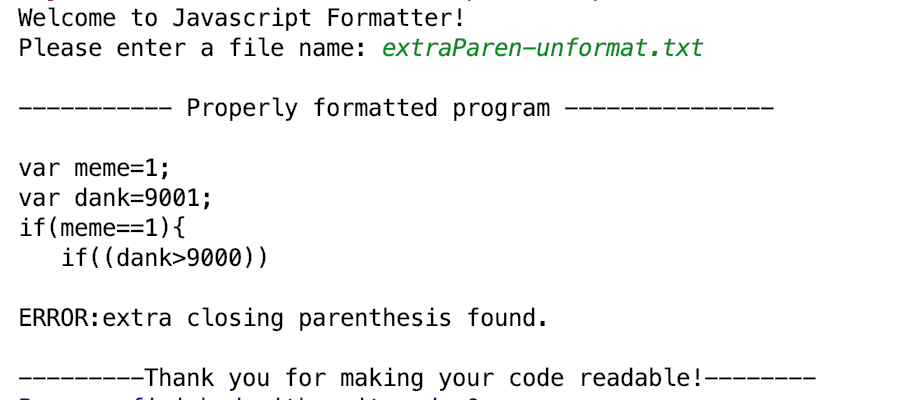

# JavaCodeFormatter
Code Formatter, Indent, Parenthesis checker, Code formatting.  

## Prerequisites
Eclipse, Intelli-J Idea

## Features
- Indent code
- Format code
- Check code validations, Braces missing parenthises 

### Images

 

## Author
[Waheed Nazir](https://www.linkedin.com/in/waheed-nazir-36521579/ "Waheed Nazir (WaveTechStudio)")

## License
It is totally free to use. :)

